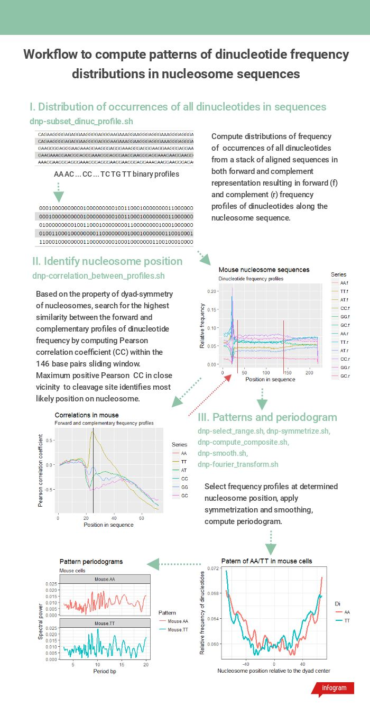

dnpatterntools v1.0 
---------------------

A set of tools to analyze patterns of dinucleotide distributions in nucleosomal DNA sequences in fasta. 

Most often, computation of these features
is implemented individually which makes difficult to compare and reproduce results 
produced in different projects. This repository contains tools to convert fasta sequences into binary strings of 
dinucleotide occurrences, to compute dinucleotide frequencies of occurrence in a batch of aligned fasta
sequences, to identify patterns of dinucleotide distributions in nucleosomes DNA, to smooth pattern and compute
its periodogram. Fully functional Galaxy wrappers are provided in the *tools* folder. On Linux machine a `planemo serve 
<https://planemo.readthedocs.io/en/latest/readme.html>`_ launches a Galaxy instance in which the tools can be 
readily used. The *galaxy-workflow.pdf* describes how to use the tools in Galaxy.

Core utilities are written in C++ using the `SeqAn library <https://seqan.readthedocs.io/en/master/>`_ . 
The core utilities are available through conda. Building core utilities from source depend on SeqAn.
The tools to analyze dinucleotide patterns in nucleosomes independ on the core utilities 
and are implemented as shell scripts.  
   
Structure
"""""""""""       

The whole dnpatterntools directory structure is shown in a tree diagram::

   dnpatterntools/
   ├── bin
   ├── source
   ├── test
   ├── tools
   │   ├── docu
   │   ├── extra
   │   └── test-data
   └── tools-extra
       ├── bioconda-recipes
       │   ├── dnp-binstrings
       │   ├── dnp-corrprofile
       │   ├── dnp-diprofile
       │   └── dnp-fourier
       └── ggplot-scripts
           └── R

The *bin* and *source* folders contain binaries (might or might not not work on your system) 
and CPP code of core programs. The core programs are summarized below: 

===================================== ========================== =======================================================================================================
Source CPP                                Name of binary             Description 
===================================== ========================== =======================================================================================================
binstrings.cpp                          dnp-binstrings            Converts fasta sequence into binary string of dinucleotide occurrences
diprofile.cpp                           dnp-diprofile             Computes profiles of dinucleotide frequency of occurrence in a batch of aligned fasta sequences 
corrprofile.cpp                         dnp-corrprofile           Computes Pearson correlation between a forward and reversed complement dinucleotide frequency profiles
Fourier_Transform.cpp                   dnp-fourier               Computes either smoothed and normalized dinucleotide frequency profile or its periodogram
===================================== ========================== =======================================================================================================

The *tools* folder contains tools that implement complete workflow to obtain and characterize dinucleotide 
patterns in a batch of fasta sequences. The tools are written in shell and depends on the core tools. 
Each tool has an associated  galaxy xml wrapper with the same name. The Galaxy wrappers tested and served 
using Planemo (to be submitted to the Galaxy ToolShed)

===================================== ========================== =======================================================================================================
Script name                           Galaxy tool name           Description 
===================================== ========================== =======================================================================================================
dnp-subset-dinuc-profile.sh           Dinucleotide frequencies   Computes frequencies of occurrence of a subset of dinucleotides in a batch of fasta
dnp-correlation-between-profiles.sh   Correlations               Computes Pearson correlation between a forward and reversed complement dinucleotide frequency profiles
dnp-select-range.sh                   Select interval            Selects rows from the dinucleotide frequency profiles matrix within a give range
dnp-symmetrize.sh                     Symmetrize                 Applies symmetrization operation on forward and complement dinucleotide profiles 
dnp-compute-composite.sh              Composite profiles         Computes composite dinucleotide frequency profiles 
dnp-smooth.sh                         Smooth                     Applies smoothing and normalization on a given dinucleotide frequency profile
dnp-fourier-transform.sh              Periodogram                Computes periodogram for a give dinucleotide profile
===================================== ========================== =======================================================================================================

The *test* folder contains shell scripts of test calls to the core programs and *dnp* tools. 

The *tools-extra* folder contains bioconda-recipes for the core tools. The ggplot-scripts contains *R* functions to visualize some of the tools outputs offline. 

How to use
------------

Download the repository or use *git clone*. Follow building instructions in the *source* folder. 
If core programs are already installed, then descend into *test* directory to run tests. Run the 
*test-dependencies.sh* to test the core programs. Run *test_tools.sh* to test tools. The test data files 
are in *tools/test-data* folder. A standard use is described in a workflow. However, these tools 
may have a wider scope of application.

Workflow description
------------------------

Computation patterns of dinucleotide frequency distributions from nucleosome sequences consists of:
   
   1. Computation of distribution of frequency of dinucleotide occurrences in a batch of aligned sequences; 
      
   2. Determination of nucleosome's position in sequences; 
      
   3. Obtaining patterns of dinucleotide frequency profiles of the determined nucleosome by applying
      a symmetrization and computation of composite dinucleotides WW/SS (W = A or T and S=C or G) 
      and RR/YY (R=A or G and Y=C or T); 

   4. Normalization and smoothing of the patterns and computing their periodograms.

The workflow steps and tools used in each step are shown in Figure 1. 

    Figure 1. The workflow of dinucleotide frequency pattern computation from a batch of nucleosomes fasta sequences. 

Use of core programs
----------------------

dnp-binstrings::

   binstrings - Binary strings from fasta
   ======================================

   SYNOPSIS
       binstrings [OPTIONS] "fastaFile.fa"

   DESCRIPTION
       This program reads the fasta file and each sequence is transformed into
       0011 form in which ones denote dinucleotides and zeros elsewhere. Binary
       sequence is printed. 
   
   REQUIRED ARGUMENTS
       FASTA_FILE STRING

   OPTIONS
       -h, --help
             Display the help message.
       --version-check BOOL
             Turn this option off to disable version update notifications of the
             application. One of 1, ON, TRUE, T, YES, 0, OFF, FALSE, F, and NO.
             Default: 1.
       -di, --dinucleotide STRING
             Dinucleotide that is to identify in fasta sequences One of AA, AC,
             AG, AT, CA, CC, CG, CT, GA, GC, GG, GT, TA, TC, TG, and TT. Default:
             CC.
       --version
             Display version information.
   
   EXAMPLES
       binstrings -di CC path/to/fasta/file.fa
             Compute binary strings matching CC in fasta sequences.
   
   OUTPUT
       100000000111000 CC chr9:42475963-42476182 CCAGGCAGACCCCATA 4
             binary string, CC, fasta id, DNA sequence, occurrences
   
   VERSION
       Last update: September 2018
       binstrings version: 1.0
       SeqAn version: 2.4.0

dnp-corrprofile::

   corrprofile - Correlations between Dinucleotide Profiles
   ========================================================
   
   SYNOPSIS
       corrprofile [OPTIONS] "dinucleotideProfilesFile"
   
   DESCRIPTION
       This program computes correlations between the profiles of dinucleotide
       frequency on forward and reverse complement sequences within a sliding
       window.
   
   REQUIRED ARGUMENTS
       PROFILE_FILE STRING
   
   OPTIONS
       -h, --help
              Display the help message.
       --version-check BOOL
             Turn this option off to disable version update notifications of the
             application. One of 1, ON, TRUE, T, YES, 0, OFF, FALSE, F, and NO.
             Default: 1.
       -w, --window INTEGER
             Sliding window size, < than length. In range [10..146]. Default: 10.
       -n, --length INTEGER
             Dinucleotide profile sequence length. In range [25..600]. Default:
             600.
       -v, --verbose
             Print parameters and variables.
       --version
             Display version information.
   
   EXAMPLES
       corrprofile -w 146 -n 400 path/to/profiles/file
             Compute correlations at each position in 400bp long profile within
             the sliding 146bp window
   
   OUTPUT
       Column of correlation coefficients
             between forward and reverse profile at each position
   
   VERSION
       Last update: April 2017
       corrprofile version: 1.0
       SeqAn version: 2.4.0

dnp-diprofile::

   diprofile - Dinucleotide Frequency Profile
   ==========================================
   
   SYNOPSIS
       diprofile [OPTIONS] "fastaFile.fa"
   
   DESCRIPTION
       This program computes a profile of a frequency of occurrence of the
       dinucleotide in a batch of fasta sequences aligned by their start
       position.
   
   REQUIRED ARGUMENTS
       FASTA_FILE STRING
   
   OPTIONS
       -h, --help
             Display the help message.
       --version-check BOOL
             Turn this option off to disable version update notifications of the
             application. One of 1, ON, TRUE, T, YES, 0, OFF, FALSE, F, and NO.
             Default: 1.
       -di, --dinucleotide STRING
             Dinucleotide to compute a frequency profile in fasta file. One of
             AA, AC, AG, AT, CA, CC, CG, CT, GA, GC, GG, GT, TA, TC, TG, and TT.
             Default: AA.
       -sl, --seqlength INTEGER
             Sequence length in fasta file. In range [25..600]. Default: 600.
       -c, --complement
             Perform computation on COMPLEMENTARY sequences of the strings in
             fasta file.
       -v, --verbose
             Print parameters and variables.
       --version
             Display version information.
   
   EXAMPLES
       diprofile -sl 146 -di CT path/to/fasta/file.fa
             Compute CT profile in fasta sequences of 146bp long
       diprofile -sl 146 -di CT -c path/to/fasta/file.fa
             Compute CT profile in sequence complements of fasta sequences of
             146bp long
   
   OUTPUT
       Column of relative frequencies of dinucleotide occurrences at each 
             position along fasta sequences of given length --seqlength

   VERSION
       Last update: April 2017
       diprofile version: 1.0
       SeqAn version: 2.4.0

dnp-fourier::

   Fourier transform and smoothing of input sequence
   input parameters:                               
   ------------------------------------------------
   -f input sequence                               
   -o output table                                  
   -l length of window of smoothing                
   -n type of normalisation:                       
        0 base normalization                      
        1 linear normalization                     
        2 quadratic normalization                  
   -t type of output table:                        
        1 normalization                            
        2 smoothing                                
        3 Fourier transform                        
                                S.Hosid 2008 - 2018
