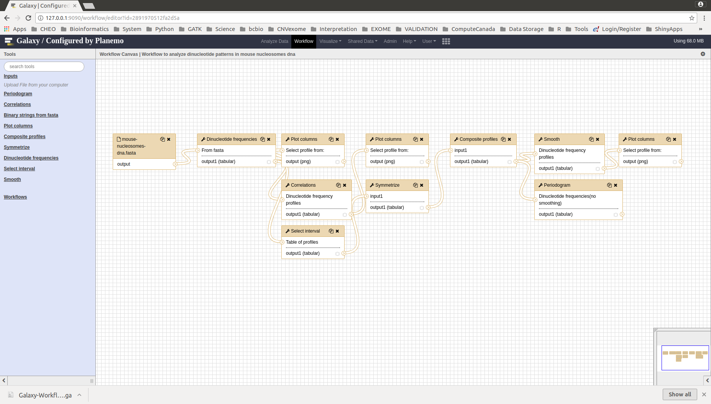
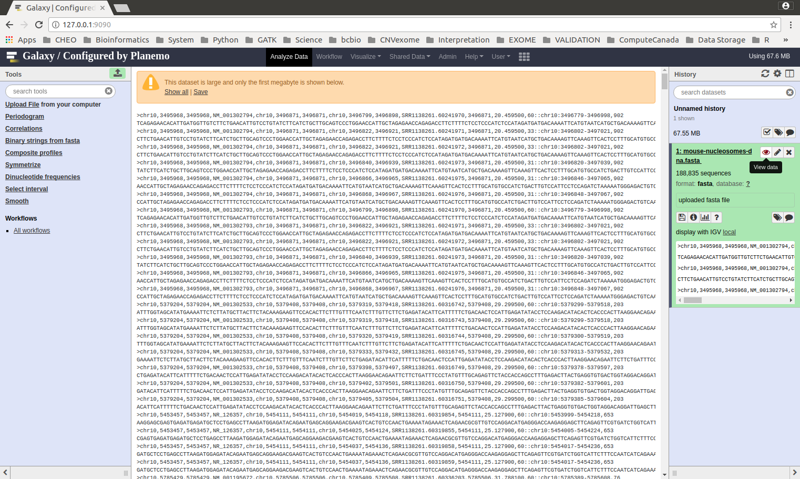
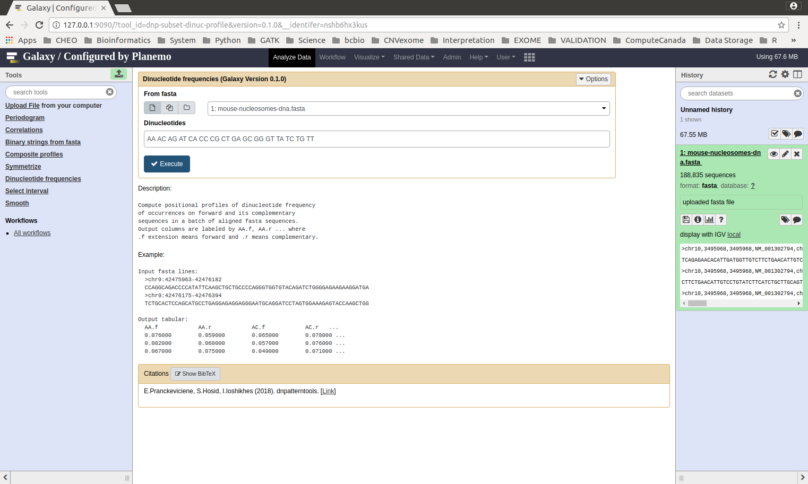
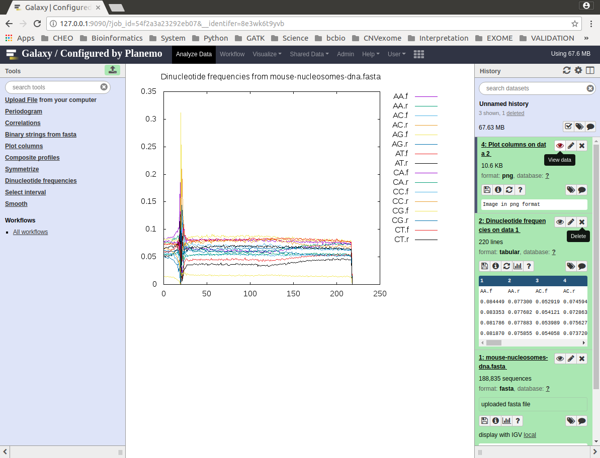
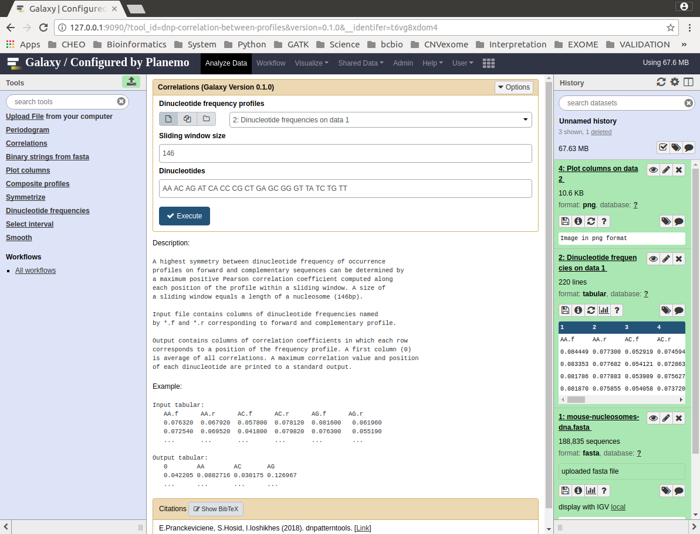
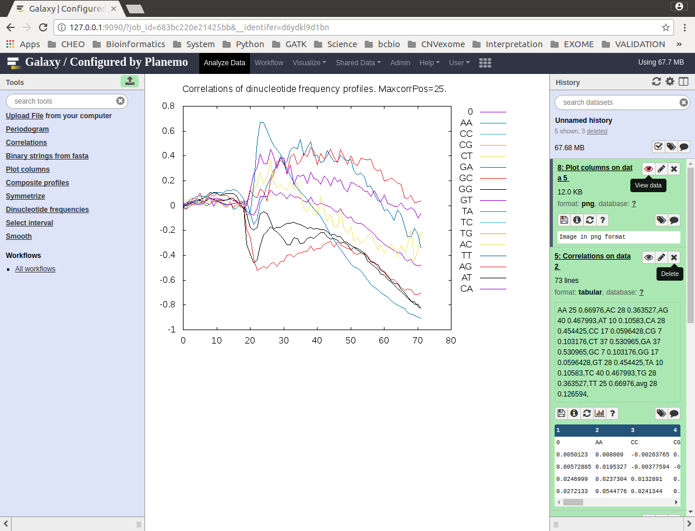
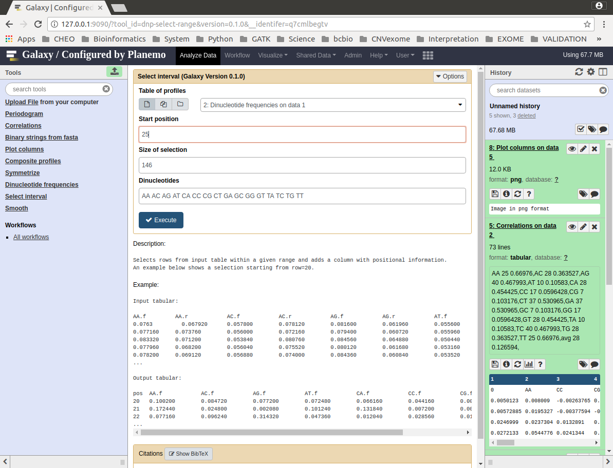
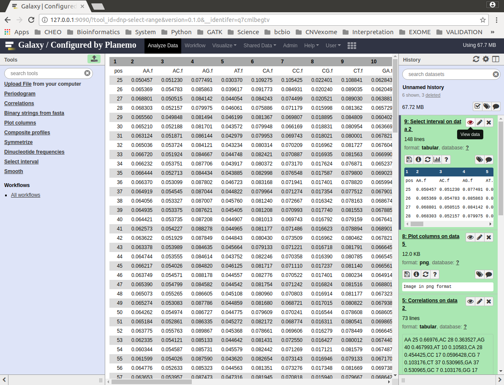
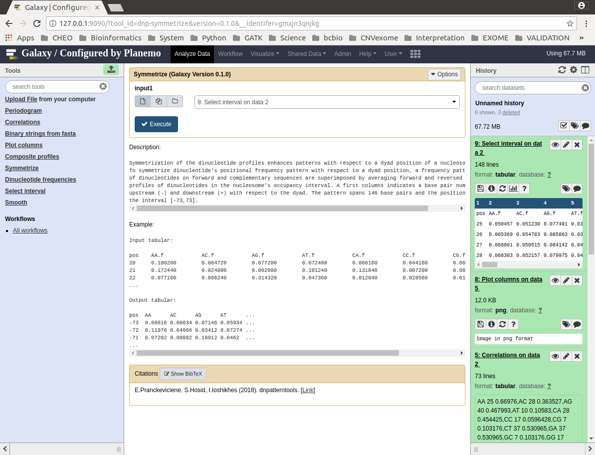
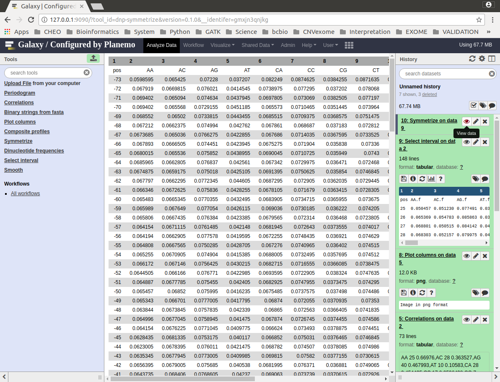

Usage of dnpatterntools v1.0 in Galaxy
----------------------------------------

This document explains steps and interface 
of the dnpatterntools v1.0 usage in Galaxy.
The Galaxy xml wrappers of tools were tested 
in Planemo. The following summary is based on 
Planemo configured Galaxy server. The example data
is available in the *test-data* folder. 

Figure 1 illustrates the owerall Galaxy worklflow.

    Figure 1. Galaxy workflow of dinucleotide frequency pattern computation from a batch of nucleosomes fasta sequences. 

Step 1. Upload data 
,,,,,,,,,,,,,,,,,,,,,,

Figure 2 shows mouse nucleosomes fasta sequences uploaded into Galaxy. The tool panel shows all dnpattern tools. 

    Figure 2. Uploaded test fasta sequences

Step 2. Compute dinucleotide frequency of occurrences
,,,,,,,,,,,,,,,,,,,,,,,,,,,,,,,,,,,,,,,,,,,,,,,,,,,,,,,

Figure 3 shows **Dinucleotide frequences** tool interface. The input is mouse nucleosomes fasta sequences uploaded into Galaxy.
Frequency profiles will be computed for all 16 dinucleotides on forward and complementary sequences. Figure 4 shows a plot of 
computed frequency profiles. Only 16 columns were plotted. The **Plot columns** tool is an extra tool for a rapid visualizaton. 

    Figure 3. **Dinucleotide frequences** tool interface.

    Figure 4. Result of **Dinucleotide frequences** tool as plot.

Step 3. Compute correlations of dinucleotide frequency profiles in each poition along a fasta sequence
,,,,,,,,,,,,,,,,,,,,,,,,,,,,,,,,,,,,,,,,,,,,,,,,,,,,,,,,,,,,,,,,,,,,,,,,,,,,,,,,,,,,,,,,,,,,,,,,,,,,,,,,

Figure 5 shows **Correlations** tool interface. Input data for correlations tools is dinucleotides frequency
profiles computed in  Step 2. Correlations are computed for all dinucleotides. Figure 6 shows output of the 
**Correlations** tool. The first column named "0" in each row contains average correlation of all dinucleotides. 
In the data section - data **5. Correlations on data 2**  contains output showing dinucleotide, its position of 
maximum positive corelation and a value of maximum positive correlation. The maximum correlation position of 
specific dinucleotides close to a cleavage site identifies a start of a nucleosome in nucleosome's dna sequences. 
This step can't be fully automated and needs visual inspection. In this example the nucleosome's starts 
at a position 25. The AA and TT had very prominent maximums at that position. Figure 7 shows a plot of correlations. 

    Figure 5. **Correlations** tool interface.

.. figure:: f5.png
    :width: 300px
    :align: center
    :height: 150px
    :alt: correlations result
    :figclass: align-center

    Figure 6. Result of **Correlations** tool.

    Figure 7. Plot of **Correlations** result.

Step 4. Select interval of nucleosome's location
,,,,,,,,,,,,,,,,,,,,,,,,,,,,,,,,,,,,,,,,,,,,,,,,,,,,,,,,,,,,,,,,,,,,,,,,,,,,,,,,,,,,,,,,,,,,,,,,,,,,,,,,

To analyze dinucleotide frequency distribution patterns in nucleosomes only profiles
that belong to the nucleosome is selected. In step 3 the start of the nucleosome location was 
identified at position 25. The tool **Select interval** selects the nucleosome's location interval 
from the frequency profiles. The start position is 25 and a size of selection is length of nucleosome 
which is 146 base pairs. Figure 8 shows interface to this tool and Figure 9 show a result of selection 
in which the first column enumerates positions relative to the original nucleosome sequence. Note that 
the input for this tool is original dinucleotide frequency profiles. 

    Figure 8. **Select interval** tool interface.

    Figure 9. Result of **Select interval** tool.

Step 5. Symmetrization and computation of composite profiles
,,,,,,,,,,,,,,,,,,,,,,,,,,,,,,,,,,,,,,,,,,,,,,,,,,,,,,,,,,,,,,,,,,

Figure 10 shows interface to the **Symmetrization** tool and Figure 11 shows
output of symmetrization. 

    Figure 10. **Symmetrization** tool interface.

    Figure 11. Result of **Symmetrization** tool.

